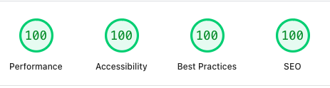
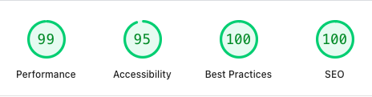

# How This Site Was Built With Astro

A year after [ditching WordPress for Jekyll](https://levelup.gitconnected.com/bye-bye-wordpress-61bc464702fb) I found myself looking at this topic again. This time for my [personal site](https://weshall.build/). My UI creation skills are limited to telling my AI agent what to do. I needed a framework that offered a better template ecosystem and retained all the good things Jekyll brought.

## Why Astro

I evaluated the usual suspects quickly. I had already done that last time, so my options were clear: Go, Pelican, Gatsby. A year had passed since I last looked. I looked again, and two new choices popped up: 11ty and Astro.

**Gatsby** was the first to go. It is React through and through. For a site that ships mostly words, pulling in GraphQL, Webpack, and a full React dependency tree is like buying a full auto repair toolkit when all I needed was a screwdriver. Great for app-like experiences. Overkill for a blog with 12 pages.

**Hugo** demands Go. I do not use Go yet. So while it has a strong ecosystem, I didn't want to get another language pack on my dev desktop.

**11ty** is minimal in the best way, but minimal also means building your own i18n, your own image pipeline, your own everything. I wanted less of my own plumbing.

**Pelican** was interesting because it's in Python, but I did not spend enough time with it. The theme selection was sparse compared to the alternatives, and the community signals were noticeably quieter.

**Astro** sat in the sweet spot. It had all the good things about Jekyll. It's built on TypeScript and works with NPM. The thing that eventually turned things completely in favour of Astro was the [theme selection](https://astro.build/themes/).

## The Template Shortcut

I did not start with `npm create astro`. I used the [Velocity](https://docs.deployvelocity.com/) template. It's an opinionated Astro 6 starter with roughly 55 pre-built components, a Tailwind v4 design system with OKLCH colour tokens, light and dark themes, and full i18n infrastructure out of the box.

The trade-off is straightforward. You trade template-specific knowledge for weeks of build time. Velocity is MIT-licensed. You keep the code, replace the branding, and move on.

There is one caveat, though. AI agents default to using standard Astro documentation rather than the template's conventions. I repeatedly found myself asking the same question: Is this change in line with the template's documentation? I now have a rule in my `Agents.md` that forces the agent to consult Velocity docs first.

## The Two-Repo Content Pipeline

Content lives in a private Obsidian vault. The public site lives in a separate repository. They connect through a manual export gate. Content flows one way: factory to portfolio, only after explicit human review. Agents are instructed not to automate or bypass this gate.

## The Scorecard

Most of the time was taken not in the code, but in getting the content right. But it's live, and the page speed insights are even better than the placeholder I created with Jekyll.

Would I do it again? Yes definitely. Starting from scratch? No way!

---

*I wrote the extended version of this story on Medium. It has everything: the framework comparison, the brand assets creation, and how my AI agent kept finding ways around testing. The same information, but with a detailed analysis of the Why?*

[*Read the full version on Medium*](https://medium.com/@vvsvish/bye-bye-wordpress-part-2-why-astro-won-my-personal-site-68c389478a92)
