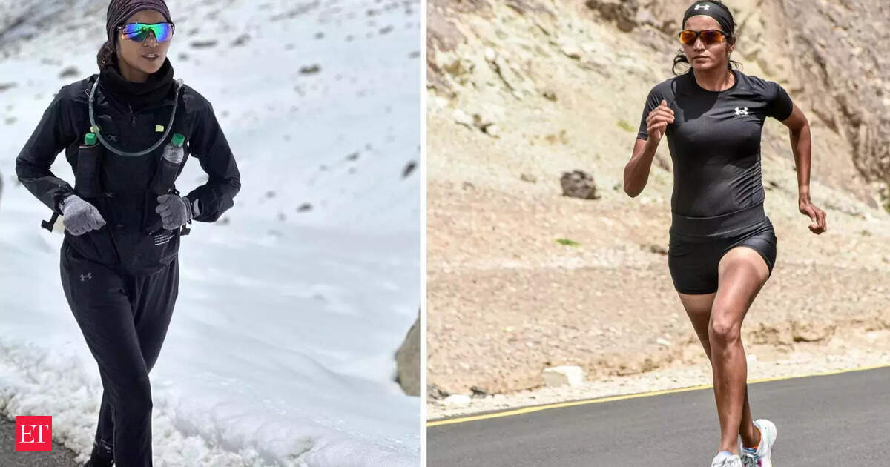

# Run Further Than a Marathon

*Forrest running through monument valley. Sorry can't use an image of the original Forrest Gump due to possible IP issues, so here is an AI generated one*

For a couple of years now, I have used a slide in my founder talks. A picture of Forrest Gump running alone through Monument Valley. The caption: "It's a marathon, not a sprint." The character was fictional, but the lesson was real. Simple mind, single focus, relentless forward motion. I believed in that slide.

This morning, I was doing my usual LinkedIn zombie scroll. A different picture stopped me. A lanky [Indian athlete holding the tricolour](https://x.com/sufirunner/status/2079247812127346739). The caption said she had just finished the Kanyakumari to Kashmir run in about 68 days.

Her name is Sufiya Sufi. She just ran 4,167 km from Kanyakumari, the southern tip of India, to Kashmir. Then she kept going toward Karakoram.

My slide character is real now. The fictional American soldier can be replaced with a real Indian "Aaj ki nari" (Woman of Today). The metaphor upgrades from fiction to fact.

---

## What the slide couldn't do

Forrest ran because the story needed him to. The slide was a convenient story I could use. It was something that everyone had seen but knew to be fiction. With fiction, it is easy not to really feel the character the same way as one empathises with a real human. 

On the other hand, Sufiya's story is real. She ran through heat, rain, heavy traffic, mountains, pain, exhaustion, and moments when her body wanted to stop. She did it while holding a purpose. Her latest run, called *Run for Dreams, was officially flagged off from Kanyakumari at 7:00 AM on May 12, marking the beginning of a historic 5,000-kilometre journey to Karakoram*. It is dedicated to the Indian Armed Forces. She runs 70 km a day. She did it with no government support, funded by [crowdfunding and sponsors](https://www.sufiyasufi.com/sponsors) who believed in her.

The real story is harder and yet more ordinary in the best way possible. The face of an ordinary person, not an actor. A person with a humble background, but incredible feats. A story, that was simply incredible at first sight. I had to find links from several news sites to believe it.

---

## What the founder journey actually looks like

I have been a founder for years. It has been the hardest, most exhausting thing I have done. Yet it has also been one of the things that gave me joy.

There were nights spent debugging at 3 am because a production incident needed fixing. Weekends were burned to close a deal. Entire days working while running a fever from COVID because the team needed support. There was depression. Sleeplessness. The kind of exhaustion that sits in your bones and does not leave.

On the bright side, there was the satisfaction of having built something outside the comfort of corporate. Something that lives in some of the world's largest banks. Software that catches exceptions when things fall through the cracks and real money is at stake. Software that prompted users to provide unsolicited and heartfelt thank you because we made their job easier. SMEs that grew because they could use our [Software as a conveyor belt](https://inbotiqa.com/convergence-of-workflow-solutions-and-email/) to run their business workflows

Those are the moments one quietly cherishes while still hoping for the financial reward that is assumed when one starts a company.

It is wake, work, sleep, repeat. Nobody claps at 3 am when you fix the incident. Nobody sees the weekends. The only feedback loop is the thing itself. Does it work? Is someone using it? Did it make their life better?

---

## Why Sufiya fits better than a marathon

A marathon has a finish line at 42 km. You train for months, run for a few hours, maybe get a medal, and stop. The distance is known. The outcome is measured. The story is complete.

Building a company does not work that way. The finish line moves. The market shifts. The product pivots. Competitors emerge from nowhere. You pace yourself for 42 km and burn out at 100.

Sufiya ran 100 times a marathon distance. One cannot possibly expect the whole thing to go according to plan. She ran the next kilometre. Then the next. As enough time passed, she had crossed the whole length of the country.

That is the founder journey. Not a single race with a known end. Just a journey with the idea of a destination. Yes, all of us definitely have plans on how to get there. But as Mike Tyson said, "Everybody has a plan until they get punched in the face" or something to that effect. I can't seem to find an exact reference to this quote, but you get my point.

The daily practice of covering distance is what matters. Running becomes a habit, and then the distance stops mattering, and only the direction matters.

---

## Three things ultra-running gets right that a marathon does not

**Patience over speed.** You cannot sprint 4,167 km by running all-nighters. You find a pace you can hold even on day 50 when your body has stopped listening. The founder equivalent is knowing that sleep is not weakness. It is fuel for the next hundred kilometres.

**Resourcefulness over planning.** The road throws things at you that no spreadsheet predicts. Heat, cold, injury, traffic, and a global pandemic. You adapt, or you stop.

**Some things may be beyond your control.** Sufiya got her Guinness certificate two years late because it [got stuck in customs](https://x.com/sufirunner/status/2017495058178838609). She posted about it with humour and gratitude. The thing that mattered here was the run, not the paper. With founders, if an order gets stuck in customs, that might hit your topline and bottom line.

**Purpose over metrics.** A marathon runner chases a time. An ultra-runner chases a reason. Sufiya ran for the soldiers, for the women who think they cannot do it, for every person who cheered from the roadside. The founder version is building something that gets an unsolicited thank you. No metric on a dashboard captures that.

---

## The slide gets an update

The new picture: Sufiya Sufi running in Kashmir. The new caption: "Run further than a marathon."

*Source: [Economic Times](https://economictimes.indiatimes.com/news/new-updates/ultra-runner-sufiya-sufi-keeps-going-even-after-breaking-5-guinness-world-records/articleshow/103601819.cms)*

The fictional American soldier taught me well. The real "Aaj ki nari" taught me better.

Building is not a sprint. It is not a marathon either. It is waking up every day and covering the next kilometre, even when the distance keeps adding, and the finish line keeps moving. It is building that one thing that matters for years. It is finding joy despite the exhaustion.

Sufiya Sufi ran 4,167 km across India, then kept going toward the Karakoram.
The long game has no finish line.

---

*If you are building something that matters and want a senior architect in the room, [let's talk](/en/contact).*

*Sources:*
- *[@sufirunner on X](https://x.com/sufirunner)*
- *Times of India: ["Indian runner sets Guinness record for fastest Manali-Leh run"](https://timesofindia.indiatimes.com/life-style/travel/things-to-do/indian-runner-sets-guinness-record-for-fastest-manalileh-run-across-high-himalayan-passes-finishes-under-100-hours/articleshow/127905167.cms) (Feb 4, 2026)*
- *Hindustan Times: ["Grit meets passion -- How Sufiya Sufi set three Guinness World Records"](https://www.hindustantimes.com/sports/others/grit-meets-passion-how-sufiya-sufi-runner-set-three-guinness-world-records-in-ultra-running-101652499428632.html) (May 14, 2022)*
- *Economic Times: ["Ultra-runner Sufiya Sufi keeps going even after breaking 5 Guinness World Records"](https://economictimes.indiatimes.com/news/new-updates/ultra-runner-sufiya-sufi-keeps-going-even-after-breaking-5-guinness-world-records/articleshow/103601819.cms) (Sep 12, 2023)*
- *Awaz The Voice: ["Sufi Sufiyan runs Kanyakumari-Kashmir in 68 days, sets world record"](https://www.awazthevoice.in/youth-news/sufi-sufiyan-runs-kashmir-kanyakumari-in-days-sets-world-record-64126.html) (Jul 21, 2026)*
