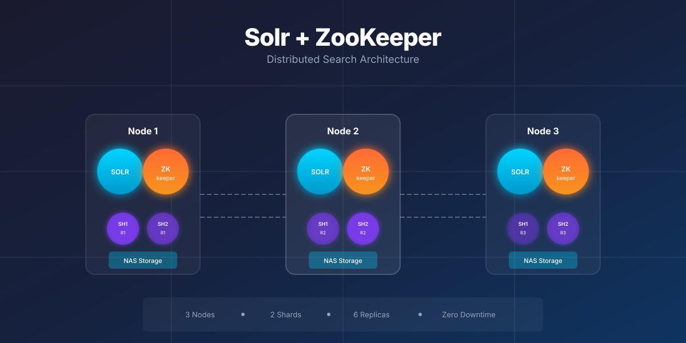

# Apache Solr and Zookeeper Scaling Guidelines

A condensed summary of an article originally published on [Level Up Coding](https://levelup.gitconnected.com/apache-solr-and-zookeeper-scaling-guidelines-269dad4fbfb2) in August 2024.

---

I have been using Apache Solr to provide search capabilities in a product that allows users to search through millions of documents in seconds. Apache Solr forms a part of the core features of the product, so these notes are based on first-hand experience.

If you are on the fence about using Solr, have a look at its ranking per [DB Engines](https://db-engines.com/en/system/Apache+Solr). At the time of writing, it is still ranked number 3 amongst search engine software and the top-ranked open source search engine available for commercial use.

## High Availability (HA) Considerations

Apache Solr requires the use of Apache ZooKeeper for cluster management. Therefore, it is necessary to also install a ZooKeeper cluster (aka Ensemble) along with an Apache Solr cluster to be able to properly scale a Solr cloud setup.

Apache Solr and Apache ZooKeeper are two separate clusters. Each of them can handle the failure of one or more nodes depending on how they are set up.

**ZooKeeper quorum rules:**
- In a ZooKeeper Ensemble, more than half of the total nodes should be up for ZooKeeper to be fully functional and responsive. For a High Availability (HA) setup, therefore, a minimum of 3 nodes are suggested.
- In general, there should be 2n+1 nodes in a ZooKeeper ensemble. It can then handle failure of up to "n" nodes.
- Solr uses ZooKeeper to manage its configuration and, as such, Solr nodes need ZooKeeper to be functional and responsive for each node of the Solr cluster to be responsive.

**Replication and resilience:**
- Solr indexes can be set up to have one or more "replicas". When there are two or more Solr nodes available, and there is a replication factor of 2, then Solr will automatically spread the replicas over multiple nodes at the time of index creation.
- As such, having a replication factor of a minimum of 2 and having a minimum of two Solr nodes helps ensure high availability.
- With more Solr nodes being available, along with a higher replication factor, better resilience and query performance can be achieved.

**Memory and storage:**
- Solr is heavy on file I/O and RAM usage; as such, when using the same storage volumes to host multiple Solr index replicas, there may be I/O limitations. In general, it is best to use separate storage volumes for each Solr Node.
- Solr, being a Java process, needs a JVM Heap allocated for it to be able to use the available RAM. As a general rule, set up each Solr Node with 8 GB to 16 GB of JVM heap.
- A higher heap size can be allocated, but it comes at the cost of longer Full Garbage Collection pause times.

## Deployment Architecture

Apache Solr and Apache ZooKeeper can be deployed on bare-metal servers, Virtual Machines (VMs) and Docker Containers. For the purpose of this architecture discussion, it is assumed that VM or bare-metal servers are used. If planning Solr deployment using Docker / Kubernetes, other sources of documentation explain the relevant deployment architecture.

Logically, the structure of the deployment won't change much. What changes is the containerization technology that is used.

**Each Solr Node will typically contain:**
- Linux OS (e.g. CentOS, Ubuntu, RHEL)
- Java Runtime Environment
- Solr installation
- Apache ZooKeeper (if the cluster is not separately installed)

**Firewall ports should be opened to allow for I/O between:**
- Solr — ZooKeeper
- Zookeeper — Zookeeper nodes
- Client Apps — Solr
- Client Apps — Zookeeper

**Post-install sequence:**
1. Spin up ZooKeeper ensemble
2. Add application-specific Solr configuration to ZooKeeper
3. Spin up Solr cluster
4. Create a Solr collection with a minimum of 2 replicas per shard

## Three Node Deployment: The Minimum Viable HA

There are three server nodes: N1, N2, N3. Each node has Solr (S), ZooKeeper (ZK) and a NAS (or equivalent) file mount to hold the index files.

The Solr Collection has been broken into 2 shards (SH1 and SH2), and each shard has 3 replicas. Thus SH1 has 3 replicas SH1R1, SH1R2, SH1R3 and similarly SH2 also has 3 replicas.

Since both shards have one replica on each Solr Node (N1, N2, N3) the whole index is available on all 3 Nodes.

**Operations considerations:**
- **Query Performance:** Since all nodes have the full index and the index is distributed into 2 shards, Solr will effectively try to use two servers on most search queries.
- **Resilience:** This configuration can handle up to two Solr processes going down. However, for ZooKeeper, a majority (more than 50%) of nodes should be up for the ensemble to function properly. In this case, the total ZK nodes are 3, so the majority is 2. As such, this configuration can handle one complete server being offline.
- **Storage:** Due to a replication factor of 3, the total storage used is three times the total index size.

## Disaster Recovery Across Data Centres

Disaster Recovery (DR) can provide a zero-downtime DR failover if each node were located in a separate data centre (in cloud provider terms, a separate region or availability zone).

If the nodes are in regions that are separated by large geographical distances, there may be a lag in replication of the nodes, leading to some of the search results being behind by a few seconds. Usually, this should not be a problem, though.

---

*The full article covers additional detail relevant to larger-scale deployments with high-throughput search workloads.*

[*Read the full version on Medium*](https://levelup.gitconnected.com/apache-solr-and-zookeeper-scaling-guidelines-269dad4fbfb2)
